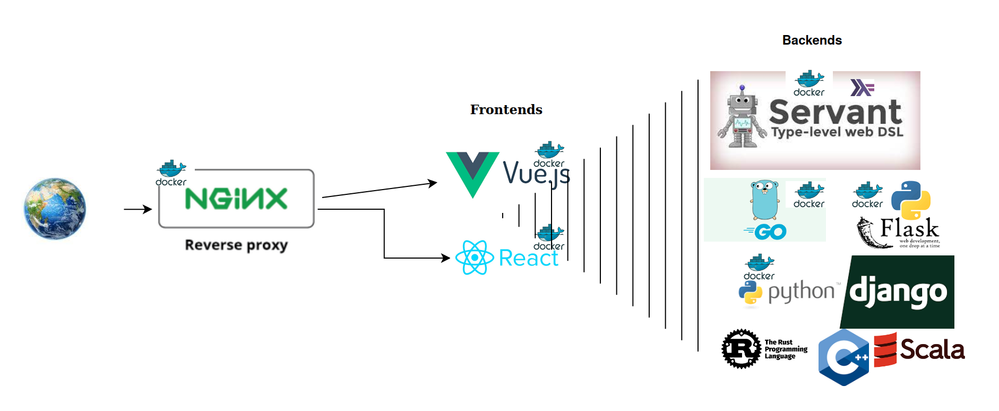

# With CHATgpt, building small toy projects has become remarkably effortless. Initially, this started as a project to explore Nginx reverse proxy and Docker, but it has since evolved into a compilation of small toy applications, quantitative trading research, a live trading bot, and the outcomes of numerous self-imposed hackathons.

# Note this is a  minimal nginx reverse proxy demo hosting

This repository contains a `docker-compose` orchestrated application with Flask, Go and Vue, React services running behind an nginx reverse proxy.

## Warning

This application and its services are not production ready, and is not propely configured for deployment. It serves only as a basic starting point to configure nginx and orchestrate several services with `docker-compose`.

## Note not all services are ready to go without API tokens
Some of the services (trading bot, live, real time indicator generators) need API tokens from exchanges (kucoin, Onanda).

## Running

To build the containers:
`docker-compose build`

To run the containers:
`docker-compose up`

## Oversimplified Diagram

